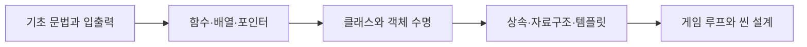

# 📘 C++ Learning Notes

**내가 배운 C++를 개념 → 예제 → 게임 응용 순서로 복습하는 학습 노트**

2026년 9월 7일~10월 1일 수업 자료를 바탕으로 정리했습니다. 세부 SVN 리비전 대신 무엇을 배웠고 어디에 적용했는지에 집중합니다.

**15개 이론 챕터** · **29개 실행 예제**

[첫 챕터부터 읽기 →](chapters/01-program-basics.md) · [예제 코드 모아 보기](examples/README.md) · [Notion 학습 노트](https://app.notion.com/p/3ec206187098817bb186c9697416190f)

## 학습 흐름



## 챕터별 이론

각 페이지에는 학습 목표, 핵심 이론, 예제 코드와 이전·다음 이동 링크가 있습니다.

| 챕터 | 페이지 | 학습 목표 |
| :---: | --- | --- |
| 01 | [프로그램의 구조와 개발 도구](chapters/01-program-basics.md) | 소스가 실행 파일이 되는 과정을 이해하고 디버깅 도구를 사용한다. |
| 02 | [입출력, 자료형, 변수와 상수](chapters/02-io-types.md) | 입력·출력과 자료형을 선택하고 초기화·형변환을 적용한다. |
| 03 | [연산자와 조건문](chapters/03-operators-conditions.md) | 연산 결과와 조건 분기를 이해하고 비트 플래그를 구성한다. |
| 04 | [반복문과 반복 제어](chapters/04-loops.md) | 반복 횟수·종료 조건을 설계하고 break·continue를 사용한다. |
| 05 | [함수, 오버로딩, 재귀와 범위](chapters/05-functions-scope.md) | 기능을 함수로 분리하고 재귀·오버로딩·이름 범위를 설명한다. |
| 06 | [배열, 포인터, 참조와 2차원 데이터](chapters/06-arrays-pointers-references.md) | 값·주소·참조의 차이를 이해하고 배열 인덱스를 안전하게 다룬다. |
| 07 | [문자열과 문자열 검색](chapters/07-strings-search.md) | C 문자열과 string의 차이를 설명하고 문자열 검색을 구현한다. |
| 08 | [구조체, 열거형과 클래스](chapters/08-structs-classes.md) | 구조체와 클래스로 데이터를 묶고 접근 권한을 설계한다. |
| 09 | [생성자, 소멸자와 동적 할당](chapters/09-lifetime-memory.md) | 객체 수명과 동적 메모리의 생성·해제 책임을 이해한다. |
| 10 | [상속, 가상 함수, 추상 클래스와 캐스팅](chapters/10-inheritance-polymorphism.md) | 가상 함수와 추상 클래스로 공통 인터페이스를 설계한다. |
| 11 | [vector, list, 반복자와 직접 만든 자료구조](chapters/11-containers-iterators.md) | 컨테이너와 반복자의 동작을 이해하고 직접 구현한 자료구조를 읽는다. |
| 12 | [템플릿, auto와 연산자 오버로딩](chapters/12-templates-operators.md) | 자료형에 독립적인 함수와 사용자 정의 연산을 작성한다. |
| 13 | [게임을 만들며 연결한 개념](chapters/13-game-design.md) | 게임 루프·좌표·씬 전환에 개별 개념을 연결한다. |
| 14 | [복습할 때 바로잡아야 할 부분](chapters/14-review-corrections.md) | 수업 원문의 미완성 부분과 복습 시 주의할 규칙을 구분한다. |
| 15 | [내가 설명하고 구현할 수 있어야 하는 것](chapters/15-learning-checklist.md) | 학습 내용을 자신의 말로 설명하고 직접 구현할 수 있는지 확인한다. |

## 수업 원문

날짜별 수업 코드와 게임 프로젝트 전체 원문은 [Notion 학습 노트](https://app.notion.com/p/3ec206187098817bb186c9697416190f)에 정리했습니다. 공개 저장소에는 이론과 직접 작성한 복습 예제를 수록합니다.

## 예제를 실행하는 방법

이론 본문의 예제 29개는 이해를 돕도록 다시 작성한 독립 실행 파일입니다. **MSVC C++17에서 각각 컴파일·실행하고 예상 결과를 확인했습니다.** 수업 원본은 작성 중인 코드도 포함하며 전체 빌드 성공을 보장하지 않습니다. 보완할 부분은 [복습 주의사항](chapters/14-review-corrections.md)과 각 수업 페이지에 정리했습니다.

Visual Studio의 **x64 Native Tools Command Prompt**에서 실행합니다.

```bat
cl /nologo /std:c++17 /EHsc /utf-8 examples\01_hello.cpp /Fe:hello.exe
hello.exe
```

29개 예제를 한꺼번에 검증하려면 같은 개발 도구 환경에서 다음 스크립트를 실행합니다.

```powershell
powershell -NoProfile -ExecutionPolicy Bypass -File .\verify-examples.ps1
```

출력 파일은 임시 폴더에 생성됩니다. 수업 코드에는 여러 main 함수가 있으므로 파일을 선택해 따로 빌드해야 합니다. 게임 프로젝트는 같은 폴더의 여러 cpp·h를 함께 사용하며 Windows 콘솔 API에 의존하는 부분이 있습니다.

## 폴더 안내

| 폴더 | 내용 |
| --- | --- |
| [chapters](chapters/) | 개념별 학습 페이지와 복습 체크리스트 |
| [examples](examples/) | 독립 실행 가능한 정리 예제 29개 |

수업 자료의 오류·미완성 부분은 원문에서 유지하고 해설에서 구분했습니다. 노트와 정리 예제는 복습을 위한 별도 작성물입니다.
